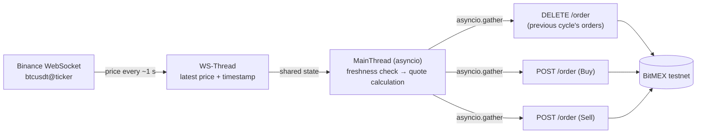
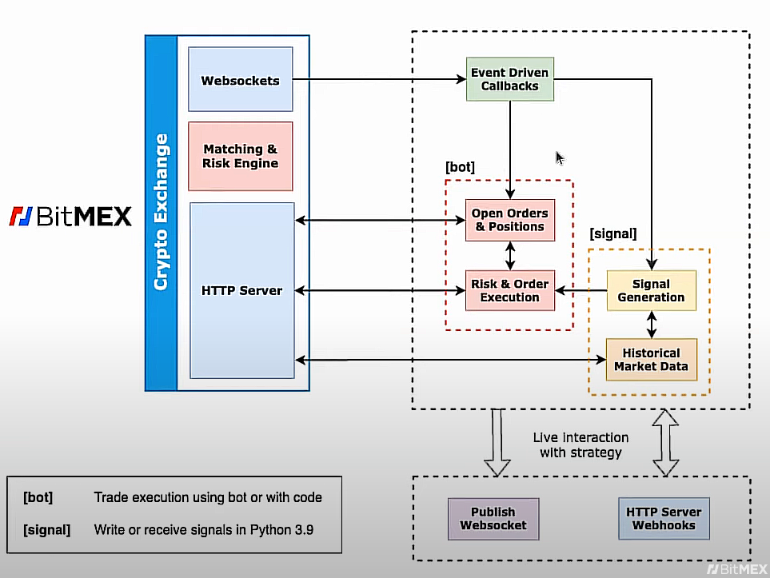
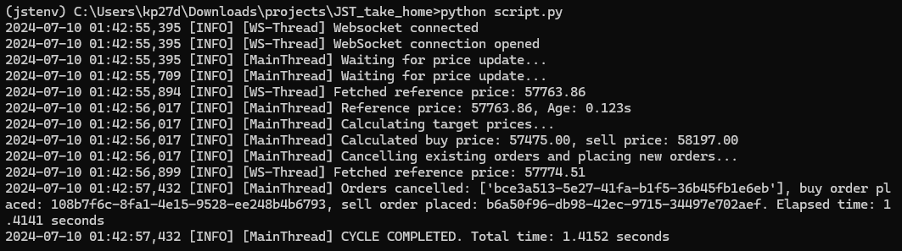
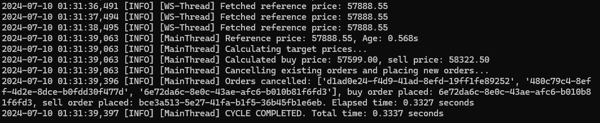
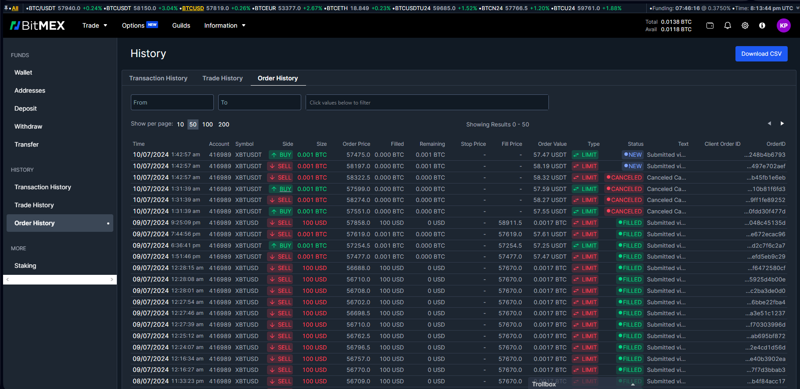

# Backstop Market Maker

A low-latency backstop market maker. It streams the BTC/USDT reference price from **Binance** over a WebSocket and keeps a buy and a sell limit order quoted around that price on the **BitMEX testnet**.

- **Cached reference price.** A dedicated WebSocket thread keeps the latest price and its timestamp in memory, so the main loop never makes a request for it.
- **Concurrent order management.** Cancel, buy and sell requests go out together with `asyncio.gather` over a shared `aiohttp` session.
- **Hand-rolled request signing.** HMAC-SHA256 authentication is implemented directly against the BitMEX REST API, without the official client.
- **Fast cycles.** A full cycle takes **~200–500 ms** in steady state, against ~2 s for a single-threaded synchronous implementation.

## Architecture



The design was inspired by [this talk](https://www.youtube.com/watch?v=xKRRquqQkAo). One of its slides suggested taking the reference price from a WebSocket:



## Project structure

```
.
├── market_maker.py     # The strategy
├── requirements.txt    # pip dependencies
├── environment.yml     # Conda environment (Python 3.11)
├── docs/images/        # Reference architecture and run screenshots
└── experiments/        # Earlier iterations, kept for reference (see experiments/README.md)
```

## Getting started

### Prerequisites

- Python 3.11 or newer (developed on 3.11.3)
- A [BitMEX testnet](https://testnet.bitmex.com) account and an API key with order permissions

### Install

With pip:

```bash
python -m venv .venv
source .venv/bin/activate        # Windows: .venv\Scripts\activate
pip install -r requirements.txt
```

Or with conda:

```bash
conda env create -f environment.yml
conda activate jstenv
```

### Set your API credentials

The script reads BitMEX credentials from environment variables, so they never live in the code:

```bash
# macOS / Linux
export BITMEX_API_KEY="your-key-id"
export BITMEX_API_SECRET="your-secret"
```

```bat
:: Windows (cmd)
set BITMEX_API_KEY=your-key-id
set BITMEX_API_SECRET=your-secret
```

### Run

```bash
python market_maker.py
```

The bot runs until you press <kbd>Ctrl</kbd>+<kbd>C</kbd>. That closes the WebSocket connection and exits cleanly.

### Configuration

Strategy parameters are set in the `__main__` block of [`market_maker.py`](market_maker.py):

| Parameter | Default | Meaning |
|---|---|---|
| `symbol` | `XBTUSDT` | BitMEX instrument to quote |
| `buy_cost` | `0.0050` | Bid placed 50 bps below the reference price |
| `sell_cost` | `0.0075` | Ask placed 75 bps above the reference price |
| `buy_qty` / `sell_qty` | `1000` | Order size in contracts (1000 = 0.001 BTC, the minimum for XBTUSDT) |
| `interval` | `60` | Seconds between cycles |

## How it works

### 1. Fetching the reference price

The [Binance ticker stream](https://developers.binance.com/docs/binance-spot-api-docs/web-socket-streams) pushes an update roughly every 1000 ms. Waiting for the next update would add that delay to every cycle. Instead, the latest price is cached and reused for up to 600 ms.

A separate thread, `WS-Thread`, receives the WebSocket messages and keeps the reference price and the time it arrived up to date. `MainThread` reads the cached value directly, so when that value is fresh, getting the reference price adds effectively no latency to a cycle.

If the cached price is older than 600 ms, the main loop waits 300 ms and checks again before quoting. This keeps orders from being placed off a stale price. Because the ticker stream only updates once per second, this wait does happen in practice (see [Future work](#future-work)).

### 2. Calculating target prices

```python
tick_size = 0.5
buy_price = round(reference_price * (1 - self.buy_cost) / tick_size) * tick_size
sell_price = round(reference_price * (1 + self.sell_cost) / tick_size) * tick_size
```

`tick_size` is the smallest price increment the instrument allows. Rounding to it keeps every price on a valid `.00` or `.50` level. The calculation is cheap enough that its latency almost always measures 0.000 s.

### 3. Cancelling and placing orders

Orders are managed through the [BitMEX REST API](https://testnet.bitmex.com/api/explorer/). Every call goes through `send_request`, which signs the request and handles the response.

`asyncio.gather` runs these three requests concurrently and waits for all of them to finish:

- cancel the orders placed in the previous cycle, by ID (`DELETE /order`)
- place the new buy order (`POST /order`)
- place the new sell order (`POST /order`)

The bot keeps the IDs of its own resting orders and cancels only those. A blanket `DELETE /order/all` sent at the same moment could reach the exchange after the new orders and cancel them too (see [Bug fix: cancel/place race](#bug-fix-cancelplace-race)). Leftover orders from an earlier run are cleared once with `DELETE /order/all` at startup, before quoting begins.

Each request's failure is handled separately. Any order that was successfully placed is tracked, and a failed cancel is retried in the next cycle, so no order is left resting on the book untracked.

This network round trip is now the only significant cost in a cycle.

### 4. Performance

| Approach | Time per cycle |
|---|---|
| Single thread, synchronous HTTP for everything ([`experiments/03_signed_rest_sync.py`](experiments/03_signed_rest_sync.py)) | ~1.8–2.5 s |
| WebSocket price thread + concurrent async REST (`market_maker.py`) | **~200–500 ms** in steady state |

The first few cycles after startup are slower, for example 1.5 s and then 800 ms. After that the cycle time settles into the 200–500 ms range.

These times are measured from the moment a fresh reference price is available. They leave out any time spent waiting for one (see [Future work](#future-work)).

## Results

> **Note:** these logs and screenshots were recorded before the [cancel/place race](#bug-fix-cancelplace-race) was fixed. Timings are unaffected, but some new order IDs show up in the "Orders cancelled" list.

Cycle log from a fresh start (first cycle, still warming up) and from steady state:




The resulting orders in the BitMEX testnet order history:



<details>
<summary>Full terminal output for 5 cycles (interval set to 10 s)</summary>

```
2024-07-09 23:08:26,565 [INFO] [WS-Thread] Websocket connected
2024-07-09 23:08:26,566 [INFO] [WS-Thread] WebSocket connection opened
2024-07-09 23:08:26,566 [INFO] [MainThread] Waiting for price update...
2024-07-09 23:08:26,878 [INFO] [MainThread] Waiting for price update...
2024-07-09 23:08:27,185 [INFO] [MainThread] Waiting for price update...
2024-07-09 23:08:27,494 [INFO] [MainThread] Waiting for price update...
2024-07-09 23:08:27,625 [INFO] [WS-Thread] Fetched reference price: 57570.0
2024-07-09 23:08:27,805 [INFO] [MainThread] Reference price: 57570.00, Age: 0.180s
2024-07-09 23:08:27,805 [INFO] [MainThread] Calculating target prices...
2024-07-09 23:08:27,806 [INFO] [MainThread] Calculated buy price: 57282.00, sell price: 58002.00
2024-07-09 23:08:27,806 [INFO] [MainThread] Cancelling existing orders and placing new orders...
2024-07-09 23:08:28,635 [INFO] [WS-Thread] Fetched reference price: 57569.99
2024-07-09 23:08:29,295 [INFO] [MainThread] Orders cancelled: ['b11731f1-f3cd-434d-a6aa-d721182f5195', 'fa093aa9-ea6a-4888-b3e7-1a9d0ad26a3d'], buy order placed: b11731f1-f3cd-434d-a6aa-d721182f5195, sell order placed: fa093aa9-ea6a-4888-b3e7-1a9d0ad26a3d. Elapsed time: 1.4898 seconds
2024-07-09 23:08:29,295 [INFO] [MainThread] CYCLE COMPLETED. Total time: 1.4907 seconds

2024-07-09 23:08:29,631 [INFO] [WS-Thread] Fetched reference price: 57569.99
2024-07-09 23:08:30,633 [INFO] [WS-Thread] Fetched reference price: 57570.0
2024-07-09 23:08:31,629 [INFO] [WS-Thread] Fetched reference price: 57569.99
2024-07-09 23:08:32,632 [INFO] [WS-Thread] Fetched reference price: 57569.99
2024-07-09 23:08:33,631 [INFO] [WS-Thread] Fetched reference price: 57569.99
2024-07-09 23:08:34,631 [INFO] [WS-Thread] Fetched reference price: 57569.99
2024-07-09 23:08:35,631 [INFO] [WS-Thread] Fetched reference price: 57570.0
2024-07-09 23:08:36,633 [INFO] [WS-Thread] Fetched reference price: 57569.99
2024-07-09 23:08:37,635 [INFO] [WS-Thread] Fetched reference price: 57570.0
2024-07-09 23:08:38,634 [INFO] [WS-Thread] Fetched reference price: 57570.0
2024-07-09 23:08:39,309 [INFO] [MainThread] Waiting for price update...
2024-07-09 23:08:39,620 [INFO] [MainThread] Waiting for price update...
2024-07-09 23:08:39,634 [INFO] [WS-Thread] Fetched reference price: 57570.0
2024-07-09 23:08:39,931 [INFO] [MainThread] Reference price: 57570.00, Age: 0.296s
2024-07-09 23:08:39,931 [INFO] [MainThread] Calculating target prices...
2024-07-09 23:08:39,931 [INFO] [MainThread] Calculated buy price: 57282.00, sell price: 58002.00
2024-07-09 23:08:39,931 [INFO] [MainThread] Cancelling existing orders and placing new orders...
2024-07-09 23:08:40,637 [INFO] [WS-Thread] Fetched reference price: 57569.99
2024-07-09 23:08:40,825 [INFO] [MainThread] Orders cancelled: ['3ef32c5d-a7eb-447a-9002-869c31505ae2'], buy order placed: 3ef32c5d-a7eb-447a-9002-869c31505ae2, sell order placed: 0d0c131a-d883-4d3f-8932-3b6c5551ab70. Elapsed time: 0.8931 seconds
2024-07-09 23:08:40,826 [INFO] [MainThread] CYCLE COMPLETED. Total time: 0.8952 seconds

2024-07-09 23:08:41,634 [INFO] [WS-Thread] Fetched reference price: 57569.99
2024-07-09 23:08:42,640 [INFO] [WS-Thread] Fetched reference price: 57570.0
2024-07-09 23:08:43,635 [INFO] [WS-Thread] Fetched reference price: 57570.0
2024-07-09 23:08:44,640 [INFO] [WS-Thread] Fetched reference price: 57569.99
2024-07-09 23:08:45,635 [INFO] [WS-Thread] Fetched reference price: 57569.99
2024-07-09 23:08:46,636 [INFO] [WS-Thread] Fetched reference price: 57569.99
2024-07-09 23:08:47,641 [INFO] [WS-Thread] Fetched reference price: 57570.0
2024-07-09 23:08:48,638 [INFO] [WS-Thread] Fetched reference price: 57569.99
2024-07-09 23:08:49,641 [INFO] [WS-Thread] Fetched reference price: 57569.99
2024-07-09 23:08:50,641 [INFO] [WS-Thread] Fetched reference price: 57570.0
2024-07-09 23:08:50,831 [INFO] [MainThread] Reference price: 57570.00, Age: 0.190s
2024-07-09 23:08:50,831 [INFO] [MainThread] Calculating target prices...
2024-07-09 23:08:50,831 [INFO] [MainThread] Calculated buy price: 57282.00, sell price: 58002.00
2024-07-09 23:08:50,831 [INFO] [MainThread] Cancelling existing orders and placing new orders...
2024-07-09 23:08:51,059 [INFO] [MainThread] Orders cancelled: ['b8b4e38e-de93-486f-a7c3-ef32282e7b17', '0d0c131a-d883-4d3f-8932-3b6c5551ab70'], buy order placed: 4b1f5da1-5e9e-49de-b816-9e55f95a5284, sell order placed: b8b4e38e-de93-486f-a7c3-ef32282e7b17. Elapsed time: 0.2264 seconds
2024-07-09 23:08:51,059 [INFO] [MainThread] CYCLE COMPLETED. Total time: 0.2279 seconds

2024-07-09 23:08:51,635 [INFO] [WS-Thread] Fetched reference price: 57570.0
2024-07-09 23:08:52,642 [INFO] [WS-Thread] Fetched reference price: 57560.79
2024-07-09 23:08:53,636 [INFO] [WS-Thread] Fetched reference price: 57560.53
2024-07-09 23:08:54,640 [INFO] [WS-Thread] Fetched reference price: 57560.52
2024-07-09 23:08:55,640 [INFO] [WS-Thread] Fetched reference price: 57560.52
2024-07-09 23:08:56,643 [INFO] [WS-Thread] Fetched reference price: 57560.53
2024-07-09 23:08:57,643 [INFO] [WS-Thread] Fetched reference price: 57560.53
2024-07-09 23:08:58,642 [INFO] [WS-Thread] Fetched reference price: 57560.52
2024-07-09 23:08:59,647 [INFO] [WS-Thread] Fetched reference price: 57560.52
2024-07-09 23:09:00,645 [INFO] [WS-Thread] Fetched reference price: 57560.53
2024-07-09 23:09:01,072 [INFO] [MainThread] Reference price: 57560.53, Age: 0.427s
2024-07-09 23:09:01,073 [INFO] [MainThread] Calculating target prices...
2024-07-09 23:09:01,073 [INFO] [MainThread] Calculated buy price: 57272.50, sell price: 57992.00
2024-07-09 23:09:01,074 [INFO] [MainThread] Cancelling existing orders and placing new orders...
2024-07-09 23:09:01,316 [INFO] [MainThread] Orders cancelled: ['4b1f5da1-5e9e-49de-b816-9e55f95a5284'], buy order placed: 54719057-8391-4120-a811-0d65202de74f, sell order placed: e6ab132a-b854-4772-84f5-28393aedc12b. Elapsed time: 0.2420 seconds
2024-07-09 23:09:01,317 [INFO] [MainThread] CYCLE COMPLETED. Total time: 0.2451 seconds

2024-07-09 23:09:01,646 [INFO] [WS-Thread] Fetched reference price: 57560.53
2024-07-09 23:09:02,644 [INFO] [WS-Thread] Fetched reference price: 57560.52
2024-07-09 23:09:03,644 [INFO] [WS-Thread] Fetched reference price: 57560.53
2024-07-09 23:09:04,645 [INFO] [WS-Thread] Fetched reference price: 57560.53
2024-07-09 23:09:05,650 [INFO] [WS-Thread] Fetched reference price: 57560.53
2024-07-09 23:09:06,646 [INFO] [WS-Thread] Fetched reference price: 57560.52
2024-07-09 23:09:07,647 [INFO] [WS-Thread] Fetched reference price: 57560.52
2024-07-09 23:09:08,649 [INFO] [WS-Thread] Fetched reference price: 57560.52
2024-07-09 23:09:09,650 [INFO] [WS-Thread] Fetched reference price: 57560.52
2024-07-09 23:09:10,650 [INFO] [WS-Thread] Fetched reference price: 57560.52
2024-07-09 23:09:11,329 [INFO] [MainThread] Waiting for price update...
2024-07-09 23:09:11,642 [INFO] [MainThread] Waiting for price update...
2024-07-09 23:09:11,649 [INFO] [WS-Thread] Fetched reference price: 57560.52
2024-07-09 23:09:11,950 [INFO] [MainThread] Reference price: 57560.52, Age: 0.301s
2024-07-09 23:09:11,950 [INFO] [MainThread] Calculating target prices...
2024-07-09 23:09:11,950 [INFO] [MainThread] Calculated buy price: 57272.50, sell price: 57992.00
2024-07-09 23:09:11,950 [INFO] [MainThread] Cancelling existing orders and placing new orders...
2024-07-09 23:09:12,186 [INFO] [MainThread] Orders cancelled: ['da0249fc-d2fd-495e-9d85-cdd4556536e5', 'e6ab132a-b854-4772-84f5-28393aedc12b', '54719057-8391-4120-a811-0d65202de74f'], buy order placed: f4078ab6-79bc-429d-b9c3-ffe8e91304c2, sell order placed: da0249fc-d2fd-495e-9d85-cdd4556536e5. Elapsed time: 0.2362 seconds
2024-07-09 23:09:12,186 [INFO] [MainThread] CYCLE COMPLETED. Total time: 0.2362 seconds
```

</details>

## Development history

### Baseline: single thread, synchronous, all HTTP

The first version ([`experiments/03_signed_rest_sync.py`](experiments/03_signed_rest_sync.py)) did every step in sequence over plain HTTP. One cycle took roughly 1.8–2.5 s:

```
--- Starting new cycle ---
1. Getting reference price...
   Reference price: 57427.13
   Latency for getting reference price: 0.2999 seconds
2. Calculating target prices...
   Buy price: 57140.00
   Sell price: 57858.00
   Latency for calculating target prices: 0.0000 seconds
3. Cancelling existing orders...
   Cancel result: []
   Latency for cancelling existing orders: 0.4285 seconds
4. Placing new orders...
   Buy order result: 02e566e4-81c0-45df-9b1e-400208c9115a
   Sell order result: cb993f70-acfc-4483-b7e8-c1048c45135d
   Latency for placing new orders: 1.3075 seconds
5. Cycle completed. Total time: 2.0401 seconds
```

### Other approaches tried

- **The official [`bitmex` Python client](https://github.com/BitMEX/api-connectors/tree/master/official-http/python-swaggerpy).** It made a negligible difference to latency. Its main benefit is that it handles request signing for you.
- **Raw [BitMEX REST API](https://testnet.bitmex.com/api/explorer/) calls.** Generating a valid signature was tricky at first, probably because of bytes-to-UTF-8 conversions. The [BitMEX reference authenticator](https://github.com/BitMEX/api-connectors/blob/master/official-http/python-swaggerpy/BitMEXAPIKeyAuthenticator.py) didn't work out of the box. Once signing worked, the focus moved to multithreading so the loop could use the latest price without waiting 600–800 ms.

### Bug fix: cancel/place race

The first concurrent version sent `DELETE /order/all` in the same `asyncio.gather` as the two new orders. Nothing guarantees the exchange processes the cancel first. When a new order arrived before the cancel, the cancel removed it as well. In the 5-cycle log above, 4 of the 5 cycles cancel at least one of their own new orders. In the first cycle, both new orders are cancelled immediately, which leaves nothing quoted.

The fix cancels only the previous cycle's orders by ID, so the requests stay concurrent and the cycle time doesn't change. It was checked by running the real `run()` loop against a simulated exchange with random per-request latency:

| Version | Cycles ending with exactly one bid and one ask |
|---|---|
| Cancel all orders concurrently | 103 / 300 |
| Cancel previous cycle's orders by ID | 300 / 300 |

With 15–40% of requests failing at random, the tracked order IDs still matched the orders on the book after every cycle.

Every intermediate version, including a C++ port, is in [`experiments/`](experiments/) with a short description of each.

## Future work

- **Real-time reference price.** The Binance `@ticker` stream only updates once per second, so the cached price is often older than the 600 ms freshness limit and the loop waits up to ~0.6 s for the next update. In the sample log, 2 of the 4 steady-state cycles had to wait. The cycle timer restarts after each wait, so the reported times leave it out: cycles 2 and 5 are reported as 0.90 s and 0.24 s but really took ~1.5 s and ~0.86 s. Switching to the real-time `@bookTicker` stream would remove the wait, and its best bid and ask give a mid price, which is a better reference than the last trade.
- **Pull quotes when something goes wrong.** Any WebSocket error or close currently stops the bot, so the reconnect loop never actually runs, and Binance drops every connection after 24 hours. When the bot exits, including on <kbd>Ctrl</kbd>+<kbd>C</kbd>, its last quotes stay on the book at stale prices. It should reconnect automatically, cancel its orders on shutdown, and arm BitMEX's `cancelAllAfter` dead-man's switch so the exchange pulls the quotes if the process dies.
- **Re-quote on price moves, not only on a timer.** With a 60 s interval, quotes can sit unchanged for a minute while the reference price moves. What matters most is how quickly quotes follow the reference, not how long a single cycle takes. Re-quoting whenever the reference moves by more than a set number of bps, with the interval as a fallback, would close that gap.
- **Position and risk management.** The bot doesn't track fills, inventory or exposure limits, and doesn't hedge on the reference exchange. A backstop market maker gets filled exactly when prices dislocate, so it needs position limits and hedging before it could run unattended.
- **Order round-trip latency.** Cancelling and placing orders is now the only step that significantly affects cycle time. Options include amending resting orders in place (`PUT /order`) instead of cancelling and re-placing them, and running closer to the exchange.
- **Separation of concerns.** Splitting the code into smaller modules would make it easier to extend, for example a class per exchange and a separate WebSocket price feed.
- **Configuration.** Exchange, symbol, reference feed and strategy parameters could come from CLI arguments or a config file instead of the `__main__` block.
- **Heavier pricing logic.** The current price calculation is trivial. A more complex model would need its own latency budget and optimisation.
- **Testing.** Add unit tests for request signing, price calculation and WebSocket handling, and integration tests against the testnet.
